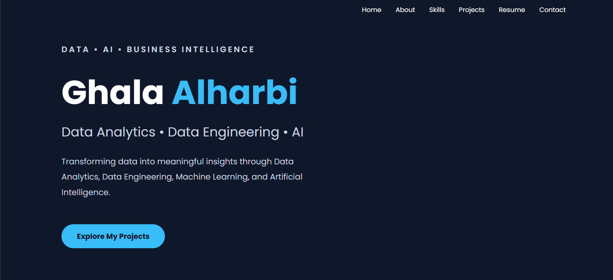

# 💼 Ghala Alharbi Portfolio

Welcome to my personal portfolio website.

This portfolio showcases my background as a **Data Science Graduate**, highlighting my technical projects, skills, certifications, and professional journey. It serves as a central place to explore my work, GitHub repositories, and contact information.

---

## 🌟 About

This portfolio was developed to present my projects and experience in a clean, responsive, and user-friendly interface. It includes detailed information about my featured projects, technical skills, education, and ways to connect with me.

---

## 🚀 Features

- Responsive and modern user interface
- Professional project showcase
- Technical skills section
- Education and certifications
- Contact information
- Direct links to GitHub repositories
- Optimized for desktop and mobile devices

---

## 🛠 Technologies Used

- HTML5
- CSS3
- JavaScript

---

## 📂 Featured Projects

### 🏥 AI Clinical Decision Support System
An AI-powered healthcare platform for ICU patient monitoring and clinical decision support using Machine Learning and Streamlit.

### 📅 Smart Meeting Management System
A web-based meeting management system built with ASP.NET MVC for scheduling meetings, managing employees, and tracking participants.

### ✅ Task Manager System
A task management application designed to organize daily tasks, improve productivity, and simplify project tracking.

---

## 📸 Portfolio Preview

---

## 📬 Contact

- **GitHub:** https://github.com/Ghala77-prog
- **LinkedIn:** https://www.linkedin.com/in/ghala-alharbi1/

---

⭐ If you like this portfolio, feel free to star the repository.
